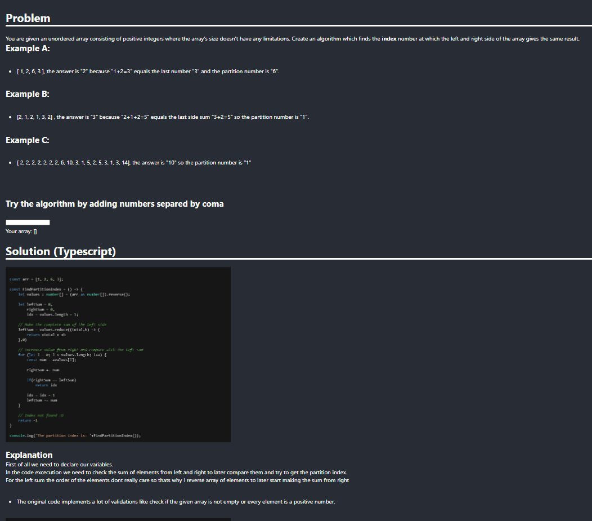

# Test 2, Fullstack (Frontend and Backend Test)

This is a working small example full stack project about and algorithm and it's solution:
- This repository is divided by client and server
- The server contains the solved algorithm + validations
- The server contains Unit testing oriented to uses cases and DDD you can find more at the [BACKEND README.md](./server/README.md).
- You can see the api available request at [Postman request.json](./server/algorithm-optimization-test-2.postman_collection.json)

## Client preview

# Stack services information
- You can find more information about the backend service at [BACKEND README.md](./server/README.md)

- You can find more information about the client service at [CLIENT README.md](./client/README.md)