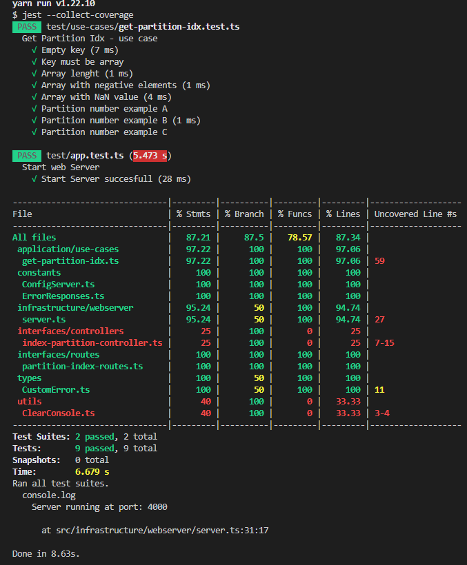

## Initialization
- The backend service contains the index partition algorithm and it's excecuted in base of the given array for the endpoint "partitionindex".

- You can find more information about the algorithm at [get-partition-idx.ts](./src\application\use-cases\get-partition-idx.ts) or in the [CLIENT README.md](../client/README.md)

- You can see the api available request at [Postman request.json](./algorithm-optimization-test-2.postman_collection.json)

## Installation

```bash
$ yarn install
```

## Running the app

```bash
# development
$ yarn run start

# watch mode
$ yarn run start:dev
```

## Open Endpoints

Open endpoints require no Authentication.

* Partitionindex : `POST /partitionindex`
    - body key: arr
        - Type: Array of positive numbers
        - Can be empty: false

## Running test

```bash
$ yarn run test
```
### Test result


